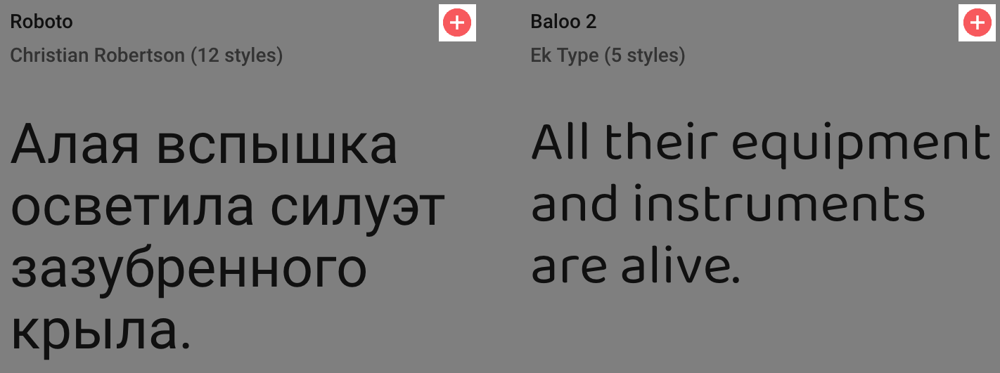
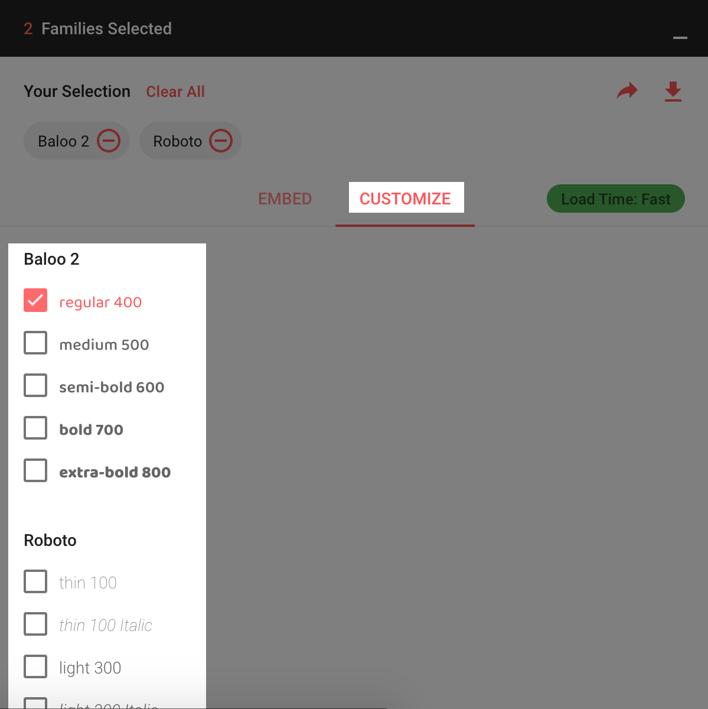
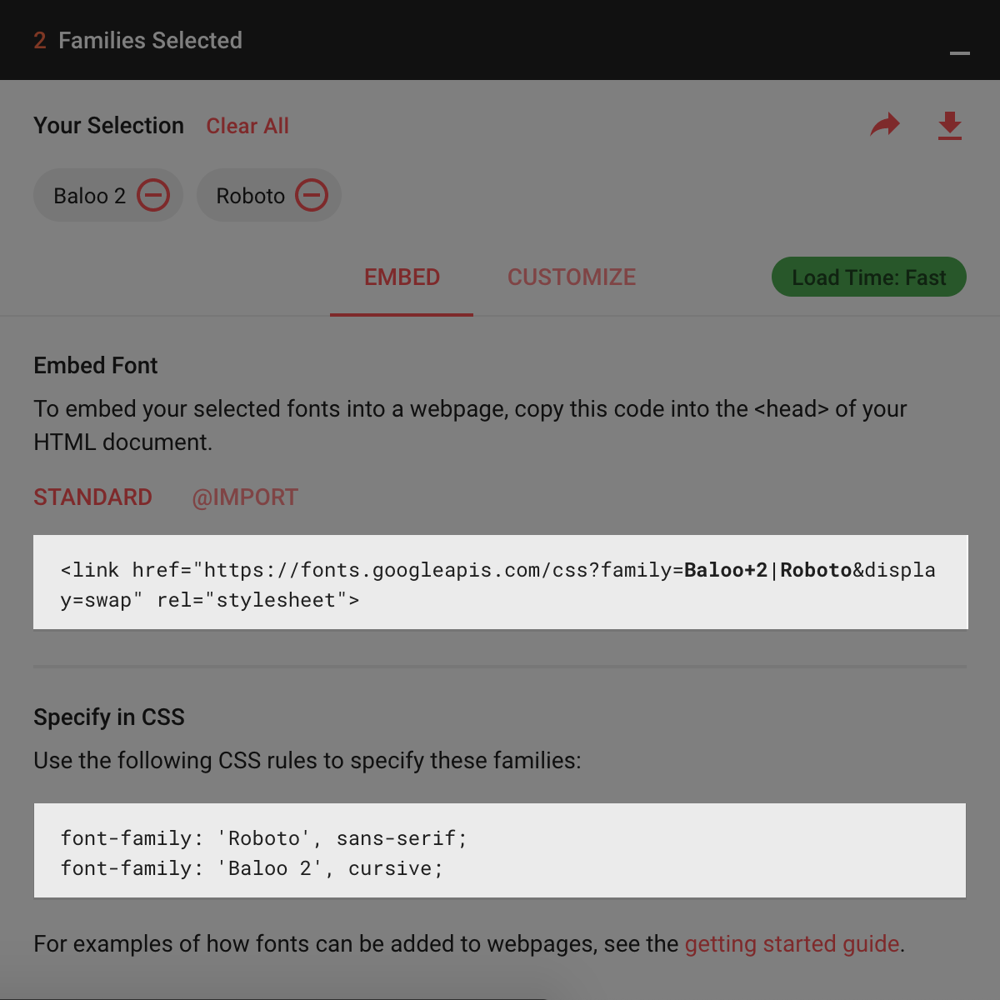

# Оформление

Для оформление игры используются игровые теги, которые не отображаются в текст

* Следующий пример сделает строку текста красным цветом 
    ```ssthreet
    Привет, новичок! # text-color red
    ```
* Пример многосрочного применения тегов
    ```ssthreet
    # text-align right
    Привет, новичок # text-color red
    ```

## Список тегов
| Тег                                                                 | Описание                                                                                       |
|---------------------------------------------------------------------|------------------------------------------------------------------------------------------------|
| # text-color [{color}](#color)                                      | Цвет текста                                                                                    |
| # font-size [{font-size}](#font-size)                               | Размер текста                                                                                  |
| # text-align [{align}](#align)                                      | Выравнивание текста                                                                            |
| # line-height [{line-height}](#line-height)                         | Межстрочный интервал                                                                           |
| # letter-spacing [{letter-spacing}](#letter-spacing)                | Межбуквенный интервал                                                                          |
| # font-style [{font-style}](#font-style)                            | Начертание текста                                                                              |
| # font-weight [{font-weight}](#font-weight)                         | Насыщенность текста                                                                            |
| # text-decoration [{text-decoration}](#text-decoration)             | Оформление текста                                                                              |
| # font-family [{font-family}](#font-family)                         | Шрифт текста                                                                                   |
| # background-color [{color}](#color)                                | Цвет фона                                                                                      |
| # background-image [{background-image}](#background-image)          | Изображение фона                                                                               |
| # background-size [{background-size}](#background-size)             | Размер фона                                                                                    |
| # background-position [{background-position}](#background-position) | Позиция фона                                                                                   |
| # background-repeat [{background-repeat}](#background-repeat)       | Повторение фона                                                                                |
| # image [{url}](#url)                                               | Вставка изображения                                                                            |
| # image-size [{width-size}](#width-size)                            | Размер изображения                                                                             |
| # image-position [{align}](#align)                                  | Позиционирование изображения                                                                   |
| # game-font [{url}](#url)                                           | Ссылка на загрузку шрифта из Google Fonts. [Инструкция](#испоnьзование-шрифтов-с-google-fonts) |
| # game-theme [{theme}](#theme)                                      | Выставление цветовой темы игры                                                                 |

## Глобальное оформление

Глобальное оформление работает так же, как обычное с одним единственным исключением, что для тега нужно проставлять префиксы

Возможные префиксы:
* `global-` Работает на всю игру и запоминает своё значение
* `location-` Работает так же и как `global-` за исключение, что когда тег пропадет, значения перестают применяться

Примеры применения:
* `global-text-color red`
* `location-text-color #eee`

Доступные теги:
* `text-color`
* `font-size`
* `font-family`
* `font-weight`
* `font-style`
* `line-height`
* `letter-spacing`
* `text-align`
* `text-decoration`
* `background-color`
* `background-position`
* `background-size`
* `background-repeat`
* `background-image`

Так же доступы не описанные раннее теги (доступны только глобально)
| Тег                                         | Описание                                                                                      |
|---------------------------------------------|-----------------------------------------------------------------------------------------------|
| # background-color-header [{color}](#color) | Цвет фона шапки                                                                               |
| # text-color-header [{color}](#color)       | Цвет текста и элементов в шапки                                                               |
| # color-primary [{color}](#color)           | Цвет интерактивных элементов, таких как например: цвет кнопок (ссылок), бордер инпутов и т.д. |
| # color-primary-shadow [{color}](#color)    | Цвет тени (при выделении) интерактивных элементов описанных выше                              |
| # text-color-choice [{color}](#color)       | Цвет кнопок (ссылок). По умолчанию наследуется от `# color-primary` 
| # max-width [{width-size}](#width-size)     | Максимальная ширина контейнера

Так же доступно оформление в зависимости от темы

Доступные темы:
* `dark` Тёмная тема
* `light` Светлая тема

Для их использования так же нужно проставлять префиксы вместе с глобальными префиксами
Примеры использования:
* `global-dark-text-color white`
* `location-light-text-color #000`

Доступные теги для использования с темами:
* `background-color-header`
* `background-color`
* `text-color`
* `text-color-header`
* `color-primary`
* `color-primary-shadow`
* `text-color-choice`

## Оформление абзацев
Для оформления абзацев нужно использовать теги с префиксом `paragraph-`

Абзацы отделяются пустой строкой

Доступные теги для оформления целового абзаца:
* `text-color`
* `font-size`
* `font-family`
* `font-weight`
* `font-style`
* `line-height`
* `letter-spacing`
* `text-align`
* `text-decoration`
* `background-color`
* `background-position`
* `background-size`
* `background-repeat`
* `background-image`

Примеры использования:
* `paragraph-text-align center`
* `paragraph-font-style italic`

## Использование шрифтов с [Google Fonts](https://fonts.google.com/)
Тут будет показан пример как загрузить и использовать шрифты с сайта https://fonts.google.com/

1. Сначала ищем и выбираем нужные нам шрифты

2. Затем настраиваем наши шрифты, выбираем начертания и нужные языки

3. Получаем ссылку и название для вставки шрифта в нашу игру

Мы должны из блока **Embed Font** выдернуть ссылку из аттрибута `href`, пример на блоке
```html
<link href="https://fonts.googleapis.com/css?family=Baloo+2|Roboto&display=swap" rel="stylesheet">
```
Мы получаем `https://fonts.googleapis.com/css?family=Baloo+2|Roboto&display=swap`, затем вставляем тег со ссылкой на шрифт в игру:
```ssthreet
# game-font https://fonts.googleapis.com/css?family=Baloo+2|Roboto&display=swap
```
И указываем в тех местах где нам нужно
```ssthreet
# global-font-family 'Roboto', sans-serif

Добро пожаловать снова #font-family 'Baloo 2', cursive
```

## Описание значений тегов

### color
Используется для обозначения цвета

Варианты использования:
1. `inherit` Наследует значение свойства от родительского элемента
2. HEX. Пример `hex(c9f63a)`, `hex(c9f63a99)`
3. RGB. Пример `rgba(0, 255, 0,)`
4. RGBA. Пример `rgba(0, 255, 0, 0.8)`
5. HSLA. Пример `hsla(120, 100%, 50%, 0.8)`

### font-size
Используется для определения размера текста

1. `inherit` Наследует значение свойства от родительского элемента
2. `px` В пикселях. Пример `24px`
3. `em` В зависимости от родителя. Например если выставить значение `1.5em`, а изходные размер текста у игры стоит `10px`, то получится `15px`
4. `%` В процентах. Так же как и `em` значение берется от родителя, но в процентах. Пример `130%`
4. `pt` В типографских пунктах (4/3 px). Пример `20pt`
5. `pc` В типографских пиках (16px). Пример `1.5pc`
6. `mm` В миллиметрах (3.8px). Пример `7mm`
7. `cm` В сантиметрах (38px). Пример `0.5cm`

### line-height
Устанавливает интерлиньяж (межстрочный интервал) текста

1. `inherit` Наследует значение свойства от родительского элемента
2. `normal` Выставляет исходное значение
3. `px` В пикселях. Пример `24px`
4. Значения множителя в числах. Пример `2` - означает, что высота строки будет равна удвоенному размеру шрифта, не важно какой шрифт
5. `pt` В пунктах шрифта. Пример `20pt`
6. `em` В зависимости от родителя. Например если выставить значение `1.5em`, а исходные размер текста у игры стоит `10px`, то получится `15px`

### letter-spacing
Определяет интервал между символами в пределах элемента.

1. `inherit` Наследует значение свойства от родительского элемента
2. `normal` Выставляет исходное значение

Так же доступные все единицы измерения описанные в [font-size](#font-size)

### font-style
Определяет начертание шрифта

1. `inherit` Наследует значение родителя.
2. `normal` Обычное начертание текста.
3. `italic` Курсивное начертание.
4. `oblique` Наклонное начертание. Курсив и наклонный шрифт при всей их похожести не одно и то же. Курсив это специальный шрифт имитирующий рукописный, наклонный же образуется путем наклона обычных знаков вправо.

### font-weight
Устанавливает насыщенность шрифта

1. `normal` Обычная насыщенность текста.
2. `bold` Полужирное начертание
3. `bolder`, `lighter` Изменяют жирность относительно насыщенности родителя, соответственно, в большую и меньшую 
4. `100-900` Численное значение с шагом 100

### text-decoration
Добавляет оформление текста в виде его подчеркивания, перечеркивания, линии над текстом и мигания. Одновременно можно применить более одного стиля, перечисляя значения через пробел.

1. `line-through` Создает перечеркнутый текст
2. `overline` Линия проходит над текстом
3. `underline` Устанавливает подчеркнутый текст
4. `none` Отменяет все эффекты.
5. `inherit` Значение наследуется у родителя.

### font-family
Устанавливает семейство шрифта, которое будет использоваться для оформления текста содержимого. Список шрифтов может включать одно или несколько названий, разделенных запятой. Если в имени шрифта содержатся пробелы, например, Trebuchet MS, оно должно заключаться в одинарные или двойные кавычки.

* `serif` шрифты с засечками (антиквенные), типа Times;
* `sans-serif` рубленные шрифты (шрифты без засечек или гротески), типичный представитель — Arial;
* `cursive` курсивные шрифты;
* `fantasy` декоративные шрифты;
* `monospace` моноширинные шрифты, ширина каждого символа в таком семействе одинакова (шрифт Courier).

Примеры: 
* `Geneva, Arial, Helvetica, sans-serif`
* `Georgia, 'Times New Roman', Times, serif`

см. [раздел](#испоnьзование-шрифтов-с-google-fonts) по установки и использованию шрифтов с сервиса Google Fonts

### url
Обычная ссылка, например: https://ss3t.io/

### background-image
Свойство background-image устанавливает одно или несколько фоновых изображений для элемента. Изображения рисуются в слоях контекстов наложения одно поверх другого. Первый слой выводится так, чтобы он был ближе всего к пользователю.

1. `url(ссылка)` Пример использования `url(http://www.example.com/bck.png)`
2. Градиенты. Пример `linear-gradient(#e66465, #9198e5))`

В интернете можно найти генераторы градиентов, например https://cssgradient.io/

### background-size
Масштабирует фоновое изображение согласно заданным размерам

1. `cover` Масштабирует изображение с сохранением пропорций так, чтобы его ширина или высота равнялась ширине или высоте блока.
2. `contain` Масштабирует изображение с сохранением пропорций таким образом, чтобы картинка целиком поместилась внутрь блока.

Так же доступные все единицы измерения описанные в [font-size](#font-size)

Можно указывать отдельно размер для каждой плоскости через пробел. Пример:
`50% auto`

### background-position
У свойства background-position два значения, положение по горизонтали (может быть — `left`, `center`, `right`) и вертикали (может быть — `top`, `center`, `bottom`). Кроме использования ключевых слов положение также можно задавать в единицах описанных в [font-size](#font-size). Если применяются ключевые слова, то порядок их следования не имеет значения, при процентной записи вначале задается положение рисунка по горизонтали, а затем, через пробел, положение по вертикали. Отношение между используемыми ключевыми словами и процентной записью следующее.

Примеры использования:
* `right bottom`
* `top`
* `top right`
* `0px 50%`

### background-repeat
Определяет, как будет повторяться фоновое изображение, установленное с помощью свойства background-image. Можно установить повторение рисунка только по горизонтали, по вертикали или в обе стороны. Допустимо указывать несколько значений для каждого фона, перечисляя значения через запятую.

* `no-repeat` Устанавливает одно фоновое изображение в элементе без его повторений, положение которого определяется свойством background-position (по умолчанию в левом верхнем углу). Аналогично no-repeat no-repeat.
* `repeat` Фоновое изображение повторяется по горизонтали и вертикали. Аналогично repeat repeat.
* `repeat-x` Фоновый рисунок повторяется только по горизонтали. Аналогично repeat no-repeat.
* `repeat-y` Фоновый рисунок повторяется только по вертикали. Аналогично no-repeat repeat.
* `space` Изображение повторяется столько раз, чтобы полностью заполнить область; если это не удаётся, между картинками добавляется пустое пространство.
* `round` Изображение повторяется так, чтобы в области поместилось целое число рисунков; если это не удаётся сделать, то фоновые рисунки масштабируются.

### width-size
Устанавливает ширину элементов

* `auto` Устанавливает ширину исходя из типа и содержимого элемента
* `%` Ширина элемента вычисляется в зависимости от ширины родительского элемента. Пример `50%`

Так же доступные все единицы измерения описанные в [font-size](#font-size)

### align 
Определяет горизонтальное выравнивание элемента

* `auto` Не изменяет положение элемента.
* `justify` Выравнивание по ширине, что означает одновременное выравнивание по левому и правому краю. Чтобы произвести это действие браузер в этом случае добавляет пробелы между словами.
* `center` Выравнивание текста по центру
* `left` Выравнивание текста по левому краю
* `right` Выравнивание текста по правому краю

### theme
Выставляет конкретную тему, может пригодиться если нет необходимости в переключение тем, что может облегчить процесс оформление игры отказавшись от одной из тем (не рекомендуется)

* `auto` Тема подставляется автоматически, позволяет пользователю переключать тему
* `light` Светлая тема, запрещает смену темы
* `dark` Тёмная тема, запрещает смену темы
